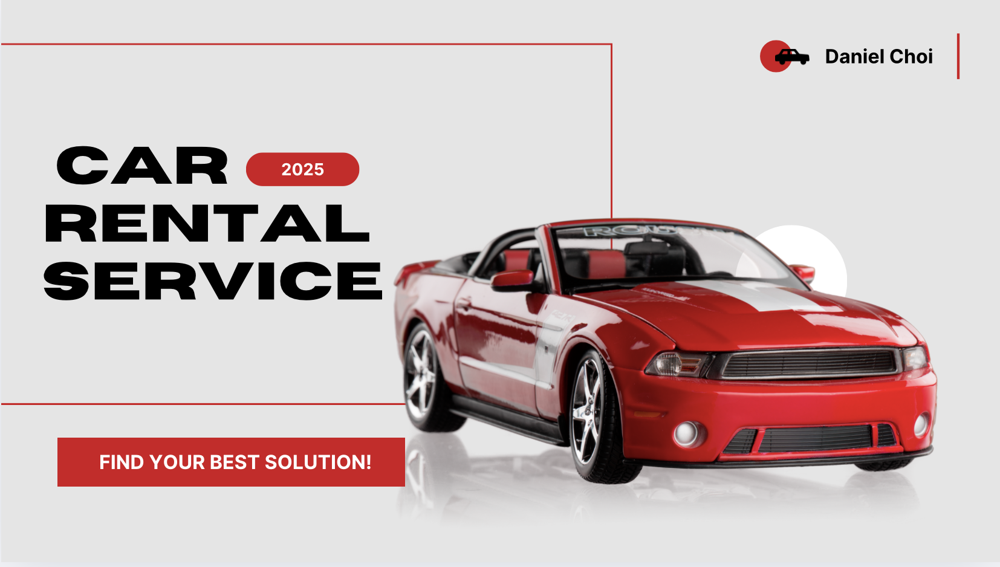

<!-- HTML로 이미지 삽입 및 크기 지정 -->


# 🚗 Car Rental System

A simple and interactive web-based car rental system built with **HTML**, **CSS**, **JavaScript (AJAX)**, and **Node.js** for backend and data persistence using **JSON**.

---

## 📦 Features

- 🔍 **Car Search & Filtering**  
  Search for available cars and filter by type, price, and availability.

- 📋 **Reservation System**  
  Users can select a car, fill in their details, and make a reservation.

- 🧾 **Confirmation Page**  
  View and confirm booking information before finalizing.

- ♻️ **Cancel & Auto-Fill Support**  
  Cancel reservation or revisit the page with auto-filled inputs.

---

## 🛠 Tech Stack

| Frontend        | Backend        | Data Storage |
|----------------|----------------|---------------|
| HTML, CSS, JS   | Node.js (Express) | JSON files     |

---

## 🗂 Project Structure

Car_Rental_System/
├── public/
│ ├── index.html
│ ├── reservation.html
│ ├── confirm.html
│ ├── styles.css
│ └── searchResults.js
├── server.js
├── cars.json
├── orders.json
└── README.md

---

## 🚀 Getting Started

### 1. Clone the repo
```bash
git clone https://github.com/DanielChoi0711/Car_Rental_System.git
cd Car_Rental_System
2. Install dependencies
(If using Express or other packages)

npm install
3. Start the server
node server.js
4. Open in browser
http://localhost:3000
📌 To Do

 Add user authentication (optional)
 Connect to real-time database
 Improve UI/UX with responsive design
 Deploy to AWS or Vercel
